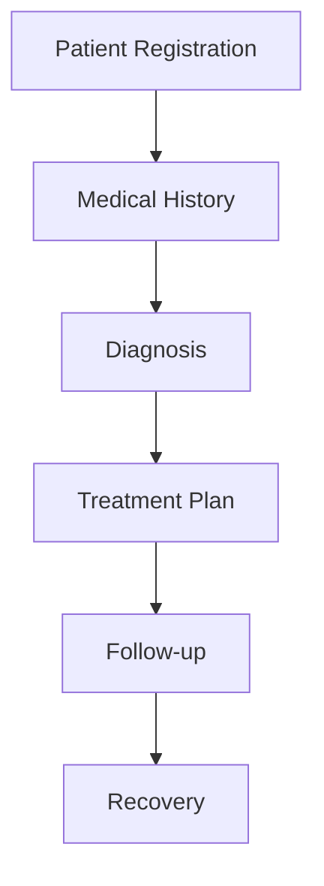

# Doctolib Theme Showcase

*A comprehensive demonstration of the Doctolib Slidev theme capabilities*

**Features • Layouts • Components • Typography**

---

# 🎨 Theme Overview

The **Doctolib Slidev Theme** provides professional presentation layouts with:

- 🏢 **Doctolib Branding** - Official logos, colors, and design elements
- 🔒 **Confidentiality Levels** - C0-C3 classification system
- 📱 **Responsive Design** - Works on all screen sizes
- 🎯 **Developer-Friendly** - Built with Vue 3 and Tailwind CSS
- 📊 **Multiple Layouts** - Cover, default, and custom layouts
- 🎨 **Professional Typography** - Montserrat font family

---
confidentialityLevel: 1
---

# 🔒 Confidentiality Levels

The theme supports four confidentiality classifications:

<div class="grid grid-cols-2 gap-6 mt-8">

<div class="bg-blue-50 p-4 rounded-lg">
<h3 class="text-blue-800 font-semibold">C0 - Public</h3>
<p class="text-sm text-blue-600">Information that can be shared openly</p>
</div>

<div class="bg-green-50 p-4 rounded-lg">
<h3 class="text-green-800 font-semibold">C1 - Internal</h3>
<p class="text-sm text-green-600">For internal company use only</p>
</div>

<div class="bg-orange-50 p-4 rounded-lg">
<h3 class="text-orange-800 font-semibold">C2 - Restricted</h3>
<p class="text-sm text-orange-600">Limited access required</p>
</div>

<div class="bg-red-50 p-4 rounded-lg">
<h3 class="text-red-800 font-semibold">C3 - Protected</h3>
<p class="text-sm text-red-600">Highest security level</p>
</div>

</div>

---
confidentialityLevel: 2
---

# 📝 Typography Showcase

The theme uses **Montserrat** font family for optimal readability.

<div class="mt-4">

## Heading Level 2
### Heading Level 3
#### Heading Level 4

</div>

<div class="mt-4">

**Bold text** and *italic text* are properly styled.

</div>

<div class="mt-3">

Regular paragraph text maintains excellent readability with proper line spacing and contrast ratios for accessibility.

</div>

<div class="mt-3">

> Blockquotes are styled with Doctolib's design system

</div>

<div class="grid grid-cols-2 gap-4 mt-3">

<div>

- Unordered lists work great
- With proper spacing
- And visual hierarchy

</div>

<div>

1. Ordered lists too
2. Are properly formatted
3. Following design standards

</div>

</div>

---
confidentialityLevel: 3
---

# 💻 Code Highlighting

The theme supports syntax highlighting for multiple programming languages:

<div class="grid grid-cols-2 gap-6 mt-6">

<div>

**TypeScript/JavaScript**
```ts {2-5|7-12|all}
interface DoctolibUser {
  id: string
  name: string
  email: string
  role: 'patient' | 'doctor' | 'admin'
}

const createUser = (userData: Partial<DoctolibUser>) => {
  return {
    id: generateId(),
    ...userData,
    createdAt: new Date()
  }
}
```

</div>

<div>

**Python**
```python {2-5|7-13|all}
class HealthcareProvider:
    def __init__(self, name: str, specialty: str):
        self.name = name
        self.specialty = specialty
        self.appointments = []

    def book_appointment(self, patient_id: str, date: str):
        appointment = {
            'patient_id': patient_id,
            'date': date,
            'status': 'confirmed'
        }
        self.appointments.append(appointment)
        return appointment
```

</div>

</div>

---
layout: image-right
image: 'https://images.unsplash.com/photo-1576091160399-112ba8d25d1f?ixlib=rb-4.0.3&ixid=M3wxMjA3fDB8MHxwaG90by1wYWdlfHx8fGVufDB8fHx8fA%3D%3D&auto=format&fit=crop&w=2070&q=80'
---

# 🏥 Healthcare Focus

Perfect for medical and healthcare presentations:

- **Patient Care** - Treatment protocols and care guidelines
- **Medical Research** - Clinical findings and research data
- **Team Training** - Onboard new healthcare professionals
- **Compliance** - HIPAA and privacy compliance
- **Technology** - Health tech innovations

Professional appearance builds trust and credibility in healthcare communications.

---
layout: center
class: text-center
---

# 🎯 Interactive Elements

<div class="text-6xl mb-8">🩺</div>

## Vue Components Work Seamlessly

<div class="flex justify-center gap-4 mt-8">
  <button class="bg-blue-600 text-white px-6 py-3 rounded-lg hover:bg-blue-700 transition-colors">
    Schedule Appointment
  </button>
  <button class="bg-green-600 text-white px-6 py-3 rounded-lg hover:bg-green-700 transition-colors">
    View Records
  </button>
</div>

<div class="mt-8 text-sm text-gray-600">
Click interactions work in presenter mode!
</div>

---
layout: two-cols
---

# 📊 Data Visualization

Charts and graphs integrate beautifully:

::left::



::right::

<div class="space-y-4">
  <div class="bg-blue-100 p-4 rounded">
    <h4 class="font-semibold text-blue-800">Appointments</h4>
    <div class="text-2xl font-bold text-blue-600">1,247</div>
  </div>

  <div class="bg-green-100 p-4 rounded">
    <h4 class="font-semibold text-green-800">Patients</h4>
    <div class="text-2xl font-bold text-green-600">892</div>
  </div>

  <div class="bg-purple-100 p-4 rounded">
    <h4 class="font-semibold text-purple-800">Satisfaction</h4>
    <div class="text-2xl font-bold text-purple-600">94%</div>
  </div>
</div>

---

# 🛠 Technical Features

## Theme Capabilities

<div class="grid grid-cols-2 gap-6">

<div>
<h3 class="text-lg font-semibold mb-3">🎨 Design System</h3>
<ul class="text-sm space-y-1">
<li>• Doctolib brand colors</li>
<li>• Consistent spacing</li>
<li>• Professional typography</li>
<li>• Accessibility compliant</li>
</ul>
</div>

<div>
<h3 class="text-lg font-semibold mb-3">🔧 Developer Tools</h3>
<ul class="text-sm space-y-1">
<li>• Vue 3 components</li>
<li>• Tailwind CSS utilities</li>
<li>• TypeScript support</li>
<li>• Hot reload development</li>
</ul>
</div>

<div>
<h3 class="text-lg font-semibold mb-3">📱 Export Options</h3>
<ul class="text-sm space-y-1">
<li>• PDF presentations</li>
<li>• PNG slide images</li>
<li>• Static HTML sites</li>
<li>• SPA deployment</li>
</ul>
</div>

<div>
<h3 class="text-lg font-semibold mb-3">🎯 Layouts</h3>
<ul class="text-sm space-y-1">
<li>• Cover slides</li>
<li>• Two-column layouts</li>
<li>• Image positioning</li>
<li>• Center alignment</li>
</ul>
</div>

</div>

---

# 🚀 Getting Started

## Installation

```bash
# Install the theme
npm install slidev-theme-doctolib

# Create a new presentation
npm init slidev@latest my-presentation
cd my-presentation
```

## Basic Usage

```markdown
---
theme: doctolib
title: My Presentation
author: Your Name
confidentialityLevel: 0
---

# Your First Slide

Content goes here...
```

---
layout: two-cols
---

# 📋 Development Commands

Essential commands for working with the theme:

::left::

**Development**
```bash
# Start dev server
npm run dev

# Build presentation
npm run build

# Export to PDF
npm run export
```

**Customization**
```bash
# Export as images
npm run screenshot

# Watch mode
npm run dev -- --open
```

::right::

**Configuration**
```yaml
# In your slides frontmatter
theme: doctolib
title: "Your Title"
author: "Your Name"
confidentialityLevel: 0-3
exportFilename: "custom-name"
```

**Requirements**
- Node.js ≥14.0.0
- Slidev ≥0.19.3
- Modern browser

---
layout: center
class: text-center
---

# 🎉 Ready to Present!

<div class="text-4xl mb-6">🏥 + 📊 = 🎯</div>

## Professional Healthcare Presentations

**Doctolib Theme for Slidev**

<div class="flex justify-center gap-6 mt-8">
  <div class="text-center">
    <div class="text-2xl">📖</div>
    <div class="text-sm">Documentation</div>
  </div>
  <div class="text-center">
    <div class="text-2xl">🐙</div>
    <div class="text-sm">GitHub</div>
  </div>
  <div class="text-center">
    <div class="text-2xl">📦</div>
    <div class="text-sm">npm Package</div>
  </div>
</div>

---
layout: end
---

# Thank You!

*This presentation was created with the Doctolib Slidev theme*

**Questions?**
